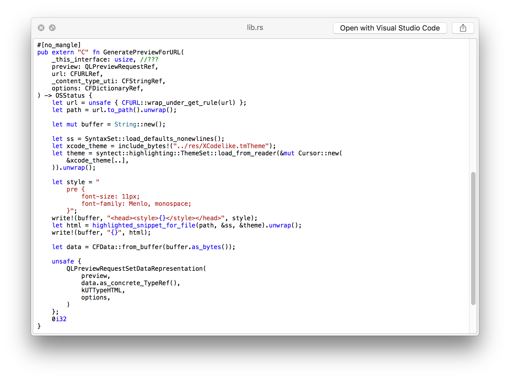

# QLSyntaxHighlight

Syntax Highlighting/Plain Text [Quick Look](http://en.wikipedia.org/wiki/Quick_Look) plugin written in Rust

## Work in progress!
- No settings
- tries to open most plaintext files
- no max file size
- no highlighting for natively supported filetypes
- doesn't generate thumbnails

### Installation

- Download from [Releases](https://github.com/Memorion/QLSyntaxHighlight/releases)
- Move the downloaded .qlgenerator file to `~/Library/QuickLook`
- Run `qlmanage -r`

